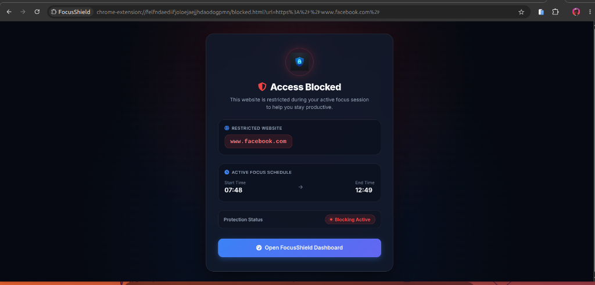
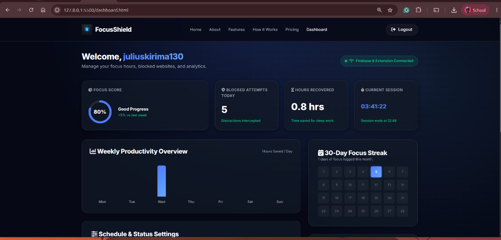
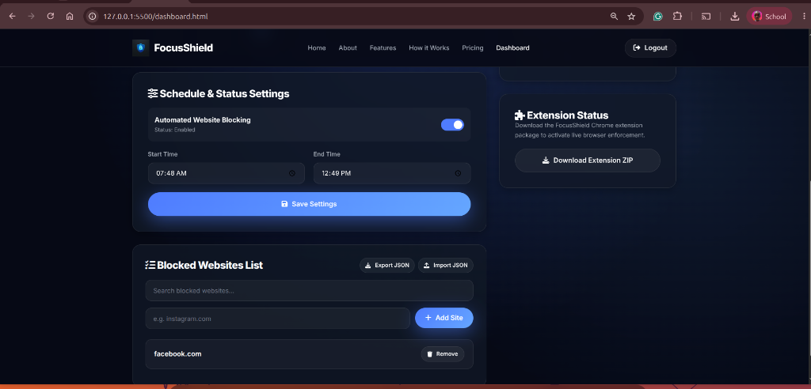

# FocusShield 🛡️

> **Block Distractions. Stay Focused. Elevate Productivity.**

FocusShield is a full-stack, zero-mock distraction management platform paired with a Manifest V3 Chrome Extension. It empowers users to define scheduled focus windows and block distracting social media websites dynamically synced via Firebase Realtime Database.

**Author:** Julius Kirima  
**Version:** 1.0.0  
**License:** MIT  

---

## 🌟 Key Features

- **🔐 Realtime Firebase Authentication:** Secure account creation and login synced seamlessly across devices.
- **⚡ Realtime Settings Synchronization:** Blocked website lists and focus schedules are stored in Firebase Realtime Database and synced live to the Chrome extension.
- **🕒 Scheduled Focus Hours:** Set custom start and end times for blocking rules to automatically take effect.
- **🚫 Automated Browser Enforcement:** Chrome Extension Manifest V3 background service worker monitors navigation and redirects blocked domain visits to a custom FocusShield blocking screen.
- **✨ Premium Dark Glassmorphic UI:** Styled with a modern dark slate palette, smooth gradients, glowing glassmorphic cards, and 100vh viewport section layouts.
- **📦 Ready-to-Deploy ZIP Packaging:** Direct in-app extension downloader for fast local developer and user deployment.

---

## 📸 Application Showcase & Screenshots

### 1. Real-time Chrome Extension Interception


### 2. Web Analytics & Focus Score Overview


### 3. Schedule Settings & Blocked Website Management


---

## 📁 Repository Architecture

```text
FOCUSSHIELD/
├── index.html              # Marketing Homepage with 100vh sections & process list
├── about.html              # Platform architecture, mission & technology stack
├── dashboard.html          # User dashboard for setting schedule & blocked websites
├── login.html              # Firebase authentication login page
├── signup.html             # User registration page
├── README.md               # Project documentation
├── assets/                 # Web application brand assets
│   └── icons/
│       ├── logo.png        # Brand logo (256x256)
│       └── favicon.png     # Website favicon (32x32)
├── css/                    # Modular Vanilla CSS Stylesheets
│   ├── main.css            # Global CSS tokens, dark theme, buttons, 100vh sections & process ULs
│   ├── dashboard.css       # Dashboard card grid and site card layouts
│   ├── auth.css            # Centered login/signup form styles
│   ├── about.css           # About page section layouts
│   └── responsive.css     # Mobile and desktop breakpoint rules
├── downloads/              # Deployable extension release packages
│   └── FocusShield-Extension.zip # Pre-packaged Chrome extension release
├── extension/              # Chrome Extension (Manifest V3) Source
│   ├── manifest.json       # Chrome Manifest V3 manifest declaration
│   ├── background.js       # Background service worker for tab monitoring & blocking
│   ├── popup.html          # Extension popup interface
│   ├── popup.js            # Extension popup authentication & live status logic
│   ├── blocked.html        # Custom blocked site landing page
│   ├── blocked.js          # Blocked page schedule reader
│   ├── config.js           # Shared Firebase and API endpoints configuration
│   ├── firebase.js         # Modular Firebase Auth & Database initialization
│   ├── extension.css       # Extension popup and blocked page stylesheet
│   └── icons/              # Extension icons (16x16, 32x32, 48x48, 128x128)
└── js/                     # Web Application JavaScript ES Modules
    ├── auth.js             # User login, registration, and logout handling
    ├── dashboard.js        # Dynamic settings retrieval, site management, & Firebase listeners
    ├── ui.js               # Dynamic DOM element getters, notification popups, & fallbacks
    ├── download.js         # Extension ZIP download trigger logic
    └── config.js           # Firebase app credentials and database paths
```

---

## 🚀 Quick Start & Installation

### 1. Running the Web Application Locally
1. Clone the repository:
   ```bash
   git clone https://github.com/kirima-julius/focusshield.git
   cd focusshield
   ```
2. Serve the directory using any static web server (e.g. VS Code Live Server or Python HTTP Server):
   ```bash
   python3 -m http.server 8000
   ```
3. Open `http://localhost:8000` in your web browser.

---

### 2. Installing the Chrome Extension

#### Method A: Direct Download via Web App
1. Navigate to the FocusShield homepage (`index.html`).
2. Click **Download Extension** to download `FocusShield-Extension.zip`.
3. Extract the downloaded `.zip` file into a folder on your computer.

#### Method B: Developer Mode Load
1. Open Google Chrome and navigate to `chrome://extensions`.
2. Enable **Developer mode** in the top-right corner toggle.
3. Click **Load unpacked** and select the `extension/` directory (or your extracted folder).
4. Click the FocusShield extension icon in your Chrome toolbar to log in and sync your settings!

---

## 🛠️ Technology Stack

- **Frontend:** HTML5, Modern Vanilla CSS3 (Glassmorphism & CSS Variables), JavaScript (ES Modules).
- **Backend & Database:** Firebase Authentication (Email/Password), Firebase Realtime Database.
- **Browser Extension:** Chrome Extension Manifest V3 API (`declarativeNetRequest`, `tabs`, `webNavigation`, `alarms`, Service Workers).

---

## ✍️ Author & Credits

Designed, architected, and engineered by **Julius Kirima**.

- **GitHub:** [@kirima-julius](https://github.com/kirima-julius)
- **Project:** FocusShield Platform & Extension

---

© 2026 FocusShield. All rights reserved.
